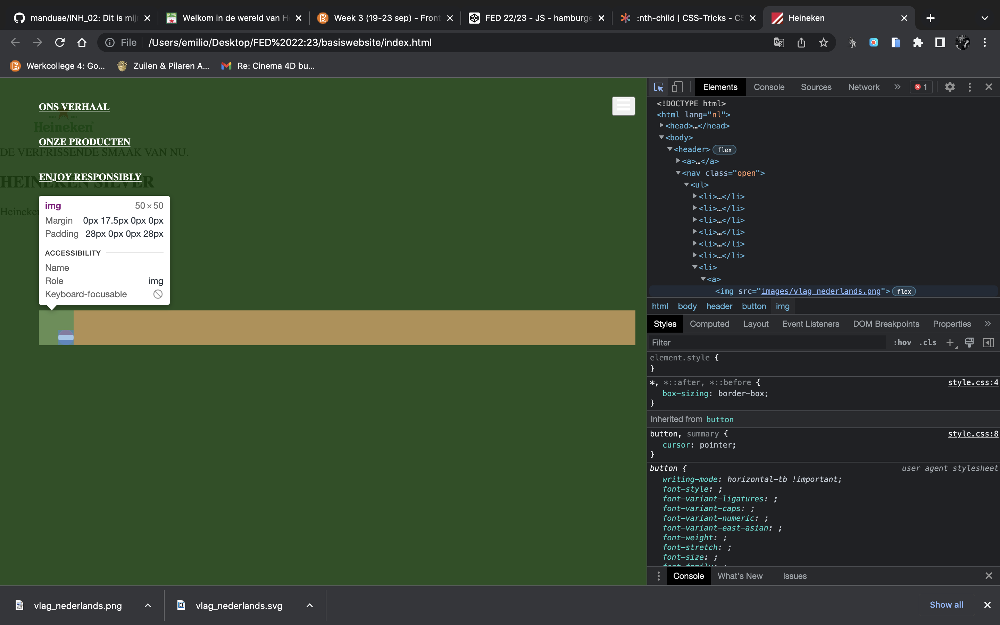
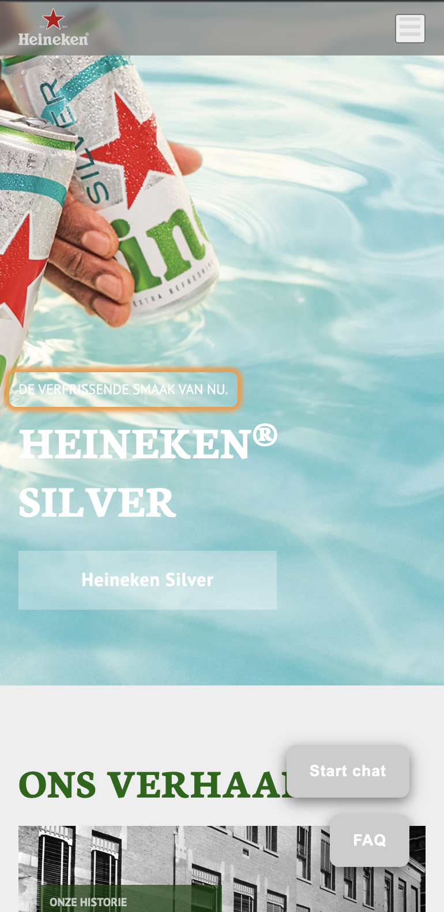
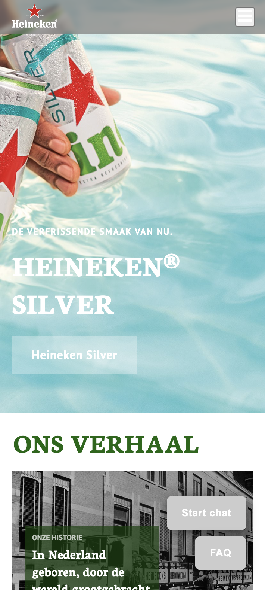
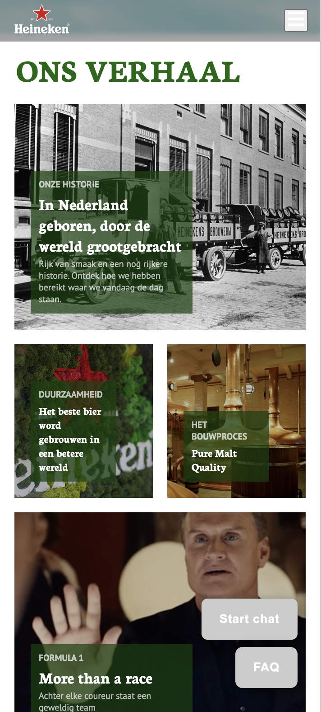
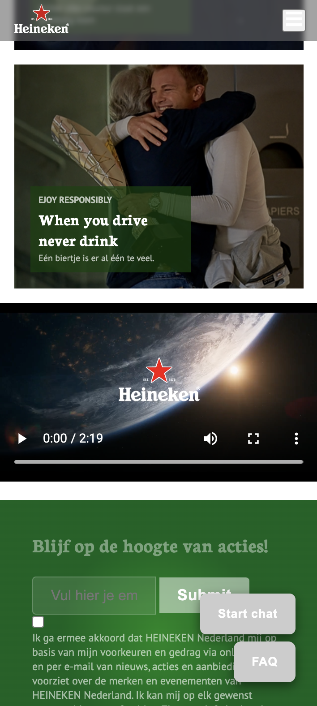
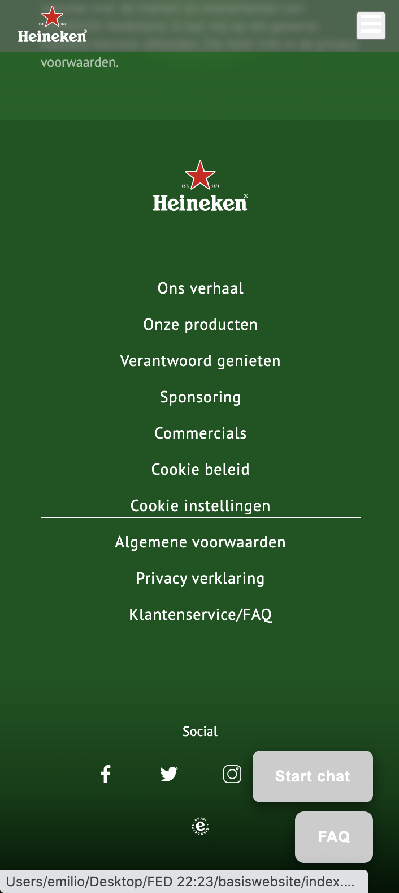
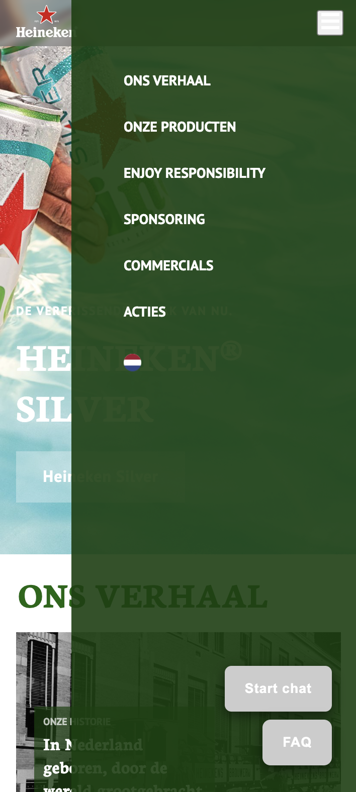
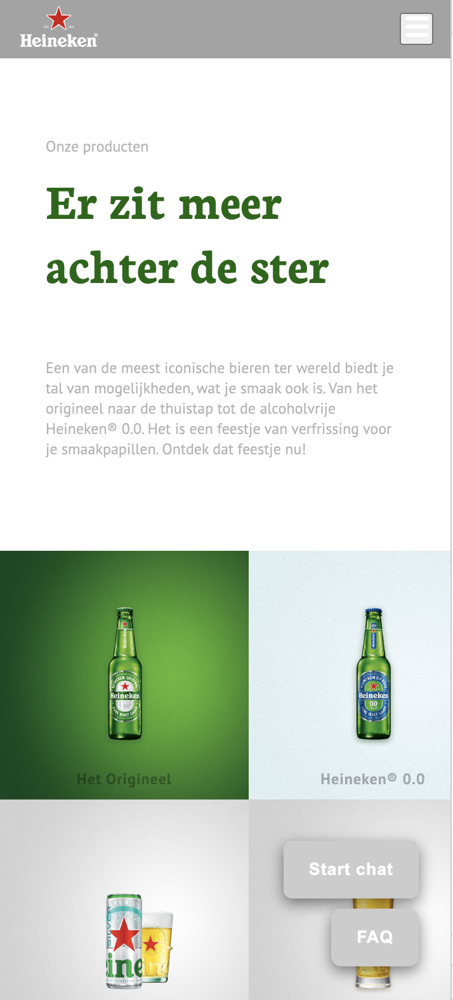
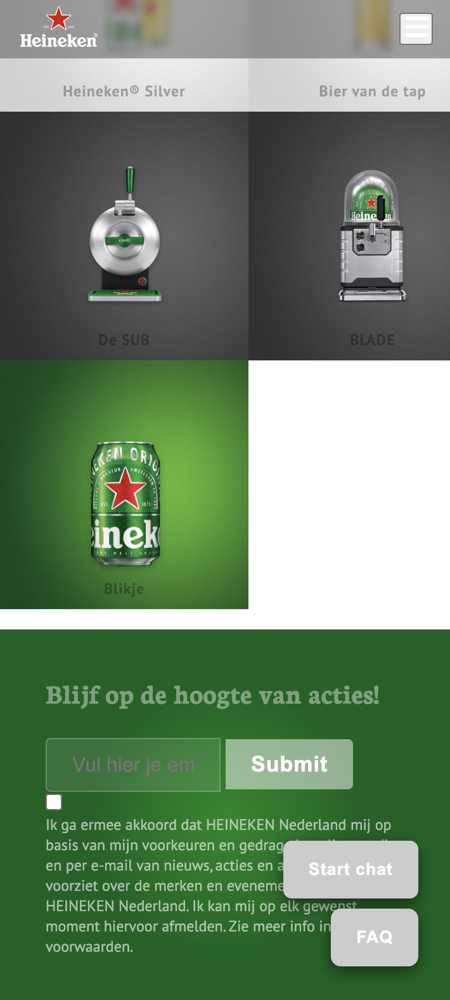
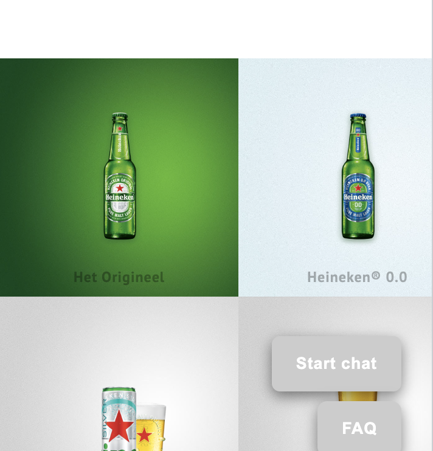

# Procesverslag
Markdown is een simpele manier om HTML te schrijven.  
Markdown cheat cheet: [Hulp bij het schrijven van Markdown](https://github.com/adam-p/markdown-here/wiki/Markdown-Cheatsheet).

## Jij

  
uitwerken voor kick-off werkgroep

  ### Auteur:
  Emilio Manduapessij

  #### Je startniveau:
  Blauw

  #### Je focus:
  Surface plane
 

## Je website

  
uitwerken voor kick-off werkgroep

  ### Je opdracht:
  https://www.heineken.com/nl/

  #### Screenshot(s) van de eerste pagina (small screen): 
  hier de naam van de pagina  
  

  #### Screenshot(s) van de tweede pagina (small screen):
  hier de naam van de pagina  
  
 
  
uitwerken na test in 1e werkgroep

  ### Bevindingen
  De website bevat voor een grotendeel div elementen, hierdoor vind ik het lastig om de website te ontrafelen middels een semantisch correcte code. Wat ook opvalt is dat de website geen main element bevat.

  #### Screenreader
  www.vanmoof.com/nl getest:
  
  - Punt 1: Het valt me op dat als je op de Nederlandse pagina komt van Van Moof, er een engelse stem te horen is.
  
  - Punt 2: Wanneer je op de pagina komt, hoor je een de slogan, echter eindigt ie abrupt in het midden:
  
  

  - Punt 3: Wanneer je de bij "taal" bent, geeft de stem aan: "NL/NL" ipv, context wat je met deze button kan doen.
  
  

  - Punt 4: Idem dito voor "Myvanmoof", geen context weergeven wat je met deze button kan doen.
  
  - Punt 5: Als je naar de artikelen gaat, geeft de screenreader niet aan om welk product het gaat:
  
  
  
  - Punt 6: Idem dito, op het moment dat je op "ontdek meer" klikt, word er niet aangegeven op welke section je zit als gebruiker.
  
  #### Muis en Toetsenbord 
  De taps zijn over het algemeen wel logisch, echter slaat de screenreader hele blokken over zonder de context te vermelden waar je je bevindt als gebruiker.
  

Ontvangen test van Giorgio:

Text nog te ontvangen.

Breakdown schets

  
uitwerken na afloop 2e werkgroep

  
  
Voortgang

  
uitwerken voor 1e voortgang

  ### Stand van zaken
  Moeite met het vertalen van breakdown schets naar HTML ivm met vragen over alle divs op de website. Hierdoor ben ik niet zeker over het schrijven van mijn HTML, ik wilde eerst voldoende feedback ontvangen van de docent gedurende voortganggesprek 1 waarop ik een 2e breakdownschets kon maken en vervolgens mijn html kon gaan schrijven.

  ### Agenda voor meeting
  samen met je groepje opstellen

  Emilio: Breakdownschets bespreken
  Giorgio: Breakdownschets en HTML bespreken
  Nathan: Breakdownschets en HTML bespreken
  Jesse: HTML bespreken
  

  ### Verslag van meeting
  hier na afloop snel de uitkomsten van de meeting vastleggen

  - Punt 1: Mijn belangrijkste vraag werd eigenlijk al beantwoord gedurende de gesprekjes voorafgaand mijn gesprek. Hierin werd veelvuldig uitgelegd dat je met unordered list of ordered list div items en article items kan tackelen. 
  - Punt 2: Header was prima: Logo met image erin, button aan de rechte kant met nav naar voren met Ul en List items.
  - Punt 3: h1 miste, "Heineken silver" h1 maken. "de verfrissende smaak van nu" vervangen van h2 naar p.
  - Punt 4: a in een button, klopt niet. Oplossing: Button leidt naar nieuwe pagina dus dit is een a element.
  - Punt 5: "ons verhaal" moet een h2 worden.
  - Punt 6: Article vervangen voor unordered list met list items.
  - Punt 7: Footer kan beknopter met ul en li items die je vervolgens individueel kan stylen met CSS.
  
  
  Hier mijn 2e versie van de breakdown: 
  
  
  
  ### Stand van zaken
  Voor mijn gevoel klopt mijn breakdown schets volledig, dit geeft rust aangezien ik nu een correcte HTML basis kan schrijven wat mij helpt in het process naar het coderen van een complete website.
  
  

  Vragen voor werkgroep 3:
  
  - Vraag 1: Hoe creer ik een dropdown voor elk individuele link in estructude nav?
  - Vraag 2: Is mijn Label + 2 input velden in de footer semantisch correct?
  - Vraag 3: HTML Controle

## Voortgang 3 (week 4)

    
  
uitwerken voor 3e voortgang

  ### Stand van zaken
  Tijdens mijn CSS proces kwam ik tot een aantal inzichtelijke conclusies. Omdat ik per breakpoint ging inspecteren, kwam ik erachter dat sommige sections weggehaald kon worden en de content hierin samengevoegd kom worden. Ik ben nu op het punt om de verschillende sections met daarin de ul en li items aan te spreken met NTH-of-type. Hier wil ik graag feedback voor ontvangen zodat ik hiermee gestructueerd verder kan. Verder is mijn navbar nu voor 80% goed. Overige 20% is de styling van de list items en de aligning bij een grotere breakpoint dan mobiel.
  
  Wat betreft mijn navbar, ik krijg het vlaggetje nog niet mooi uitgelijnd met de andere li items. Om 1 of andere reden krijg ik de margin van het vlaggetje niet links uitgelijnd.
  
  
  
  Verder heb ik wel voortgang geboekt met het gebruik van nth-of-type (in dit geval nth-of-type(7) img) toe te passen om zo het vlaggetje aan te roepen in het menu. Dit helpt veel. Echter wil ik graag feedback hoe ik dit kan toepassen op mijn sections met de bijbehorende ul, li en items in de list items.

  ### Agenda voor meeting
  samen met je groepje opstellen

  Emilio: CSS Nth child in specefiek. 
  Giorgio: HTML en CSS
  Nathan: -
  Jesse: CSS en Javascript bespreken

  ### Verslag van meeting
  hier na afloop snel de uitkomsten van de meeting vastleggen

  - punt 1: Bij het schrijven van rgb codes moet je letten op het verschil van de oude en de nieuwe manier. Bij de nieuwe manier laat je comma's achterwege en vervang je deze met een "/". Door deze aanpassing kwam de achtergrond van het menu weer naar boven.
  - Nth child toepassen hing samen met het opruimen van mijn css. Volgorde moet veranderd worden voor overzichtelijkere read.
  - Indeling/basis staat redelijk, meer focus op styling en de extra states etc.
  - Footer moet aan gewerkt worden, flex toepassen met align items center + states.

## Laatste voortganggesprek

  ### Stand van zaken
  Nu ik eenmaal de basis structuur heb overgenomen van de website, merk ik dat op het gebied van styling, veel af te lezen valt van de werkelijke website. Hoeveel padding elk element bevalt etc. Dit ben ik nu aan het toepassen en ik merk dat de website meer op zijn plaats begint te vallen:
  
  
  
  

  ### Agenda voor meeting
  samen met je groepje opstellen

  Emilio: Footer: CSS - Label & Input + Animeren Button 
  Giorgio: Ik wil het hebben over responsive maken omdat ik geen surface plain doe. En mijn pagina tot nu toe
  Hendriks: media queries en onverwachte spacing/padding/margins die nergens thuis horen + hoe je twee losse CSS dingen maakt
  Jesse: ik wil de CSS bespreken van m’n tweede pagina, en nog wat JS/Surface plande dingetjes

  ### Verslag van meeting
  hier na afloop snel de uitkomsten van de meeting vastleggen

  - H1 en P verwisselen (met -1 ask Giorgio)
  - Filter erop gooien
  - Footer h2 nodig en weghalen met "display non"
  
  Uiteindelijk is het toevoegen van een h2 met display none niet nodig geweest omdat er al een h2 in de footer aanwezig was. Het toevoegen van een filter is gelukt omdat background image is vervangen voor daadwerkelijke images.
  

    
  
Usability testing 01-11-2022

  
   ### Screenreader:
   
  Screenreader klonk logisch met bijgevoegde alt elementen, heb geen bijzondere inzichten verkregen.
   
   ### Muis & toetsenbord:
   
  Met het tappen vraag ik mij af hoe ik via de menu/button naar de linkjes ga in de lijst. Ook ga je als user vanaf het hamburger menu naar de fixed buttons onderaan de pagina. Als je enter klikt, schuift het menu wel open, echter als je verder tikt met tap, slaat ie de li items over met de a'tjes er in. Dit is nu opgelost omdat ik aan mijn pagina een max width had gegeven waardoor ie buiten het beeld verder ging tappen. Nu ik max-width heb weggehaald gaat ie wel volgens logische volgorde. Mijn 2e punt was dat de de tab niet begint bij het menu bovenaan:
  
  
  
  Ik ben er achter gekomen dat dit lag aan mijn screen reader, als het goed is begin je met het gebruik van de screenreader boven aan de header.
   

  ### Visual eye simulator bril:
  
  Jesse: 
  
  Peripheral field loss: 
  Met deze bril kan je minder goed het contrast zien van de tekst. Het is lastig om te focussen bij lichtere afbeeldingen. 
  
  Blur/Glare: Met deze bril lukte het niet goed om de tekst te lezen vanwege de grote. Gelukkig kon ik de titels wel lezen. Verder waren de achtergronden en afbeeldingen wel vaag te zien vanwege de felle kleuren. 
  
  Combined Loss Diabetic: Vanwege de flokken in je gezichtsveld is het lastig om de focus te houden. Je ziet veel afleiding wat niet helpt bij het verwezelijken van je doel.

  ### Dit ging goed/Heb ik geleerd: 
  Ik merkte dat het voor visueel slecht ziende mensen het van belang was dat tekst groter moet zijn dan 16px met een hoog contrast kleur omdat de tekst anders niet te lezen valt. Ook zijn extra animatie elementen hinderlijk voor zijn/haar user journey. 

## Eindgesprek (week 5)

  
uitwerken voor eindgesprek

  ### Je uitkomst - karakteristiek screenshots:
  
  
   
    
     
      
       
        

  ### Dit ging goed/Heb ik geleerd: 
  
  Uiteindelijk heb ik super veel geleerd tijdens deze lessen, meer dan ooit tevoren. Voor mijn gevoel zit ik nu lekker in de flow van coderen en merk ik aan mijzelf dat het automatisme begint te worden. Dit had ik bijvoorhand van de lessen niet kunnen denken, ik zat er tegen op omdat ik niet goed ben in coderen maar ik moet zeggen dat ik mijzelf heb verbaast. Dit zit 'em denk ik in het feit dat ik veel ben gaan tikken in plaats van eindeloos naar theorie te gaan kijken. Hierin merk je toch dat het een kwestie is van oefenen. Ook het toepassen van meerdere css files heeft het voor mij overzichtelijker gemaakt. 1 basis structuur met header, algemene code en footer + 2 losse .css voor elke pagina. Dit maakt het overzichtelijker en wederom leuker om te coderen. Ik begrijp de verhoudeingen van parent elementen en childeren, wanneer je een grid toepast met flex en vise versa. Ook begrijp ik beter hoe je begint met de pagina structuur. Meeste is opgebouwd uit ul met daarin list items die je via deze manier kan stijlen. Ook het gebruik van root was een verademing en logischer + efficienter. Het niet gebruiken van classes was wennen maar dit wende al snel met het gebruik van :nth-of-type() toe te voegen aan alle elementen. Ik merk dat ik hierdoor coderen ook een tikkeltje leuker ben gaan vinden dan voorheen, omdat ik dit nu beter snap. Al met al merk ik een sterke groei van afgelopen maanden, hier ben ik blij en trots om. Als laatst merk ik dat ik naast de hulp van Sanne en Jeffrey, weinig externe bronnen heb gebruikt. Ik merkte dat de stof via HVA DLO vrijwel voldoende was om het te leren begrijpen, ook omdat ik de uitleg op andere websites verwarrend vond, dit vond ik wel inzichtelijk. Niet veel bronnen gebruikt maar meer vertrouwd op mijn eigen kunnen d.m.v. het toepassen van de lessen, veel efficienter!
  
  
  Toegevoegd voor Surface plane: 
  
  - Dark/Light mode
  - Animatie
  - Reduce motion
  - Video
  - States van controls
  - Advanced positioning
  

  ### Dit was lastig/Is niet gelukt:
  Korte omschrijving met plaatjes

  Waar ik uiteindelijk van baal is dat het mij niet lukte om mijn grid op pagina 2 mee te laten schalen en fitted te maken binnen het viewport:
  
  
  
  Ik heb het list-item een size gegeven van 12.25rem hoog en breed. Ik ben er niet achter kunnen komen hoe je dit kan laten mee schalen terwijl deze BxH verhouding hetzelfde blijft.
  
  Het tweede wat niet gelukt is, is het vervangen van de homepage foto om er een filter op te gooien. Ik kwam er niet uit in combinatie met de andere elementen binnen deze section, waarschijnlijk moest ik de elementen in een div gooien met z-index maar ik durfde simpelweg geen risico te nemen omdat mijn section overhoop zou raken. Voor de andere sections is dit wel gelukt gelukkig:
  
  
  
  Verder is gelukt wat ik wilde bereiken en hier ben ik blij om.
  

## Bronnenlijst

  
continu bijhouden terwijl je werkt

  Nb. Wees specifiek ('css-tricks' als bron is bijv. niet specifiek genoeg).

  1. https://developer.mozilla.org/en-US/docs/Web/CSS/justify-content
  2. bron: https://developer.mozilla.org/en-US/docs/Web/CSS/justify-content
  3. bron: https://stackoverflow.com/questions/40010597/how-do-i-apply-opacity-to-a-css-color-variable voor het gebruiken van rgb code voor opacity ipv een HEX-code
  4. https://dlo.mijnhva.nl/d2l/le/content/437097/Home
  
  toelichting bron 4: Ik heb vrijwel alle informatie vanuit deze oefeningen en voorbeelden kunnen toepassen op mijn website, hierdoor heb ik weinig tot geen externe bronnen gebruikt omdat ik dit verwarrend vond.

