# Procesverslag
Markdown is een simpele manier om HTML te schrijven.  
Markdown cheat cheet: [Hulp bij het schrijven van Markdown](https://github.com/adam-p/markdown-here/wiki/Markdown-Cheatsheet).

## Jij

  
uitwerken voor kick-off werkgroep

  ### Auteur:
  Emilio Manduapessij

  #### Je startniveau:
  Blauw

  #### Je focus:
  Surface plane
 

## Je website

  
uitwerken voor kick-off werkgroep

  ### Je opdracht:
  https://www.heineken.com/nl/

  #### Screenshot(s) van de eerste pagina (small screen): 
  hier de naam van de pagina  
  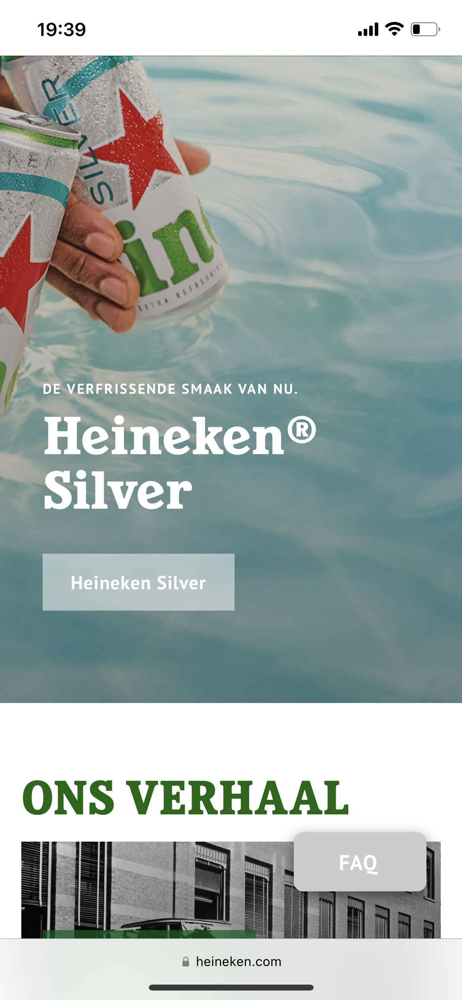

  #### Screenshot(s) van de tweede pagina (small screen):
  hier de naam van de pagina  
  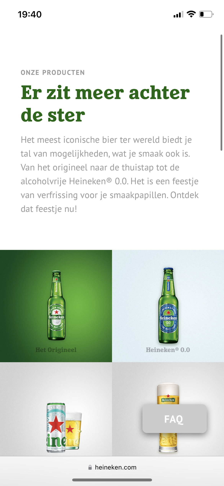
 
  
uitwerken na test in 1e werkgroep

  ### Bevindingen
  De website bevat voor een grotendeel div elementen, hierdoor vind ik het lastig om de website te ontrafelen middels een semantisch correcte code. Wat ook opvalt is dat de website geen main element bevat.

  #### Screenreader
  www.vanmoof.com/nl getest:
  
  - Punt 1: Het valt me op dat als je op de Nederlandse pagina komt van Van Moof, er een engelse stem te horen is.
  
  - Punt 2: Wanneer je op de pagina komt, hoor je een de slogan, echter eindigt ie abrupt in het midden:
  
  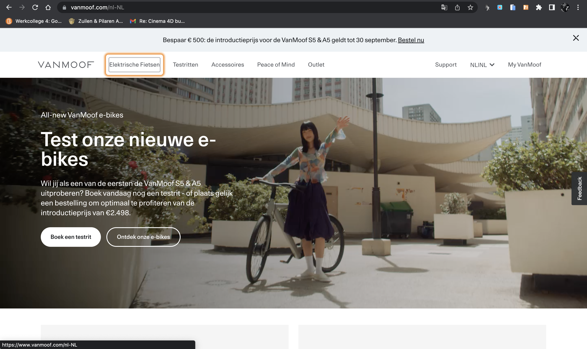

  - Punt 3: Wanneer je de bij "taal" bent, geeft de stem aan: "NL/NL" ipv, context wat je met deze button kan doen.
  
  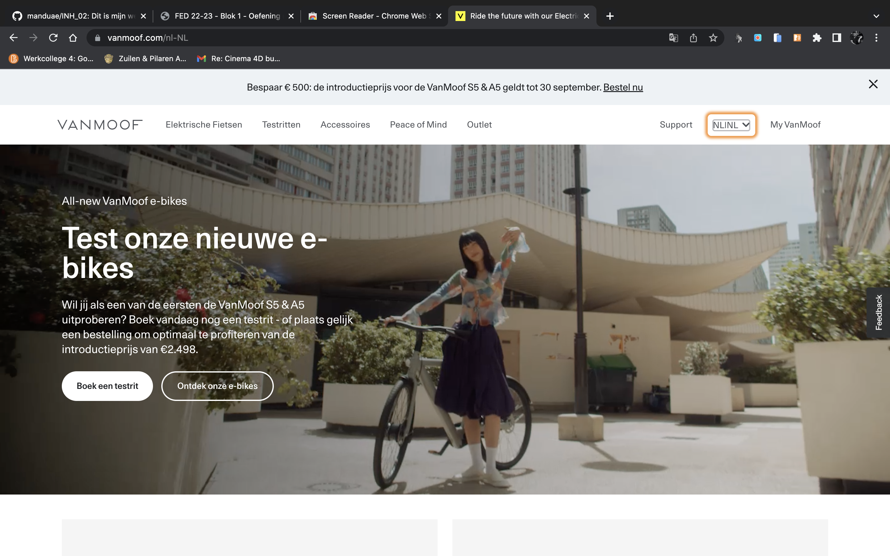

  - Punt 4: Idem dito voor "Myvanmoof", geen context weergeven wat je met deze button kan doen.
  
  - Punt 5: Als je naar de artikelen gaat, geeft de screenreader niet aan om welk product het gaat:
  
  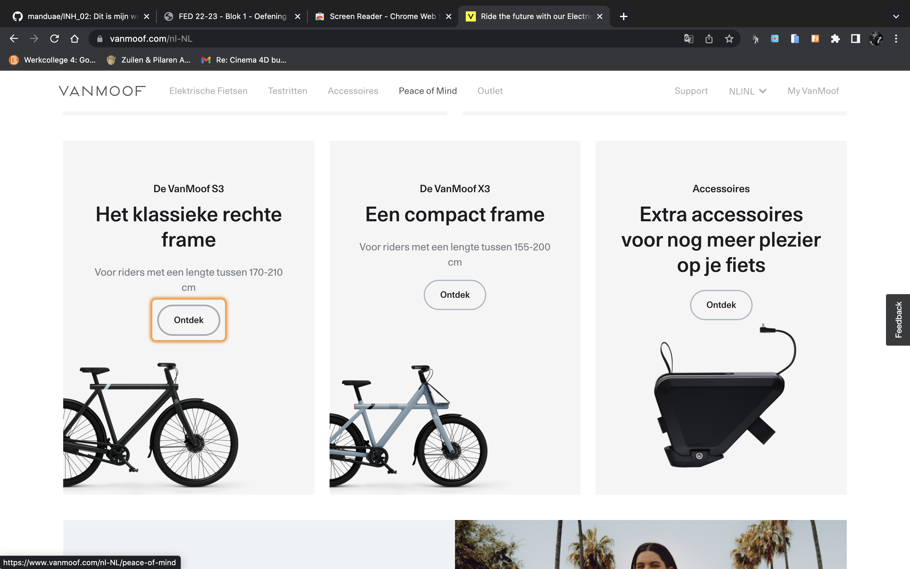
  
  - Punt 6: Idem dito, op het moment dat je op "ontdek meer" klikt, word er niet aangegeven op welke section je zit als gebruiker.
  
  #### Muis en Toetsenbord 
  De taps zijn over het algemeen wel logisch, echter slaat de screenreader hele blokken over zonder de context te vermelden waar je je bevindt als gebruiker.
  

Ontvangen test van Giorgio:

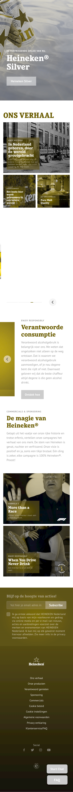
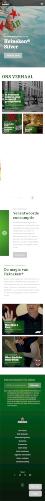
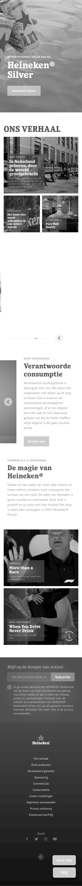
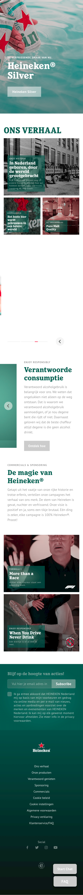
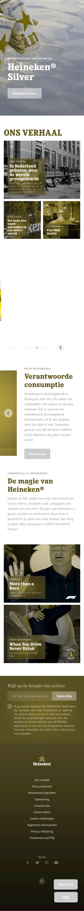

Text nog te ontvangen.

Breakdown schets

  
uitwerken na afloop 2e werkgroep

  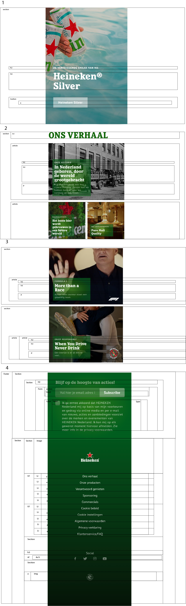
  
Voortgang

  
uitwerken voor 1e voortgang

  ### Stand van zaken
  Moeite met het vertalen van breakdown schets naar HTML ivm met vragen over alle divs op de website. Hierdoor ben ik niet zeker over het schrijven van mijn HTML, ik wilde eerst voldoende feedback ontvangen van de docent gedurende voortganggesprek 1 waarop ik een 2e breakdownschets kon maken en vervolgens mijn html kon gaan schrijven.

  ### Agenda voor meeting
  samen met je groepje opstellen

  Emilio: Breakdownschets bespreken
  Giorgio: Breakdownschets en HTML bespreken
  Nathan: Breakdownschets en HTML bespreken
  Jesse: HTML bespreken
  

  ### Verslag van meeting
  hier na afloop snel de uitkomsten van de meeting vastleggen

  - Punt 1: Mijn belangrijkste vraag werd eigenlijk al beantwoord gedurende de gesprekjes voorafgaand mijn gesprek. Hierin werd veelvuldig uitgelegd dat je met unordered list of ordered list div items en article items kan tackelen. 
  - Punt 2: Header was prima: Logo met image erin, button aan de rechte kant met nav naar voren met Ul en List items.
  - Punt 3: h1 miste, "Heineken silver" h1 maken. "de verfrissende smaak van nu" vervangen van h2 naar p.
  - Punt 4: a in een button, klopt niet. Oplossing: Button leidt naar nieuwe pagina dus dit is een a element.
  - Punt 5: "ons verhaal" moet een h2 worden.
  - Punt 6: Article vervangen voor unordered list met list items.
  - Punt 7: Footer kan beknopter met ul en li items die je vervolgens individueel kan stylen met CSS.
  
  
  Hier mijn 2e versie van de breakdown: 
  
  
  
  ### Stand van zaken
  Voor mijn gevoel klopt mijn breakdown schets volledig, dit geeft rust aangezien ik nu een correcte HTML basis kan schrijven wat mij helpt in het process naar het coderen van een complete website.
  
  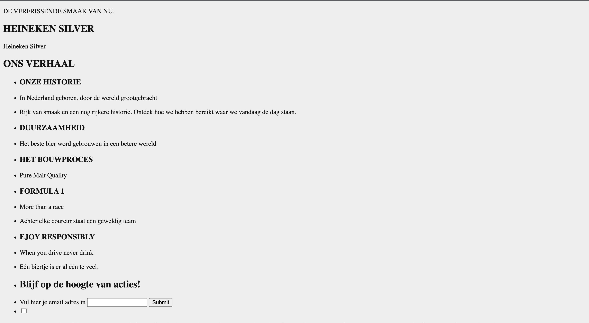

  Vragen voor werkgroep 3:
  
  - Vraag 1: Hoe creer ik een dropdown voor elk individuele link in de nav?
  - Vraag 2: Is mijn Label + 2 input velden in de footer semantisch correct?
  - Vraag 3: HTML Controle

## Voortgang 3 (week 4)

  
uitwerken voor 3e voortgang

  ### Stand van zaken
  hier dit ging goed & dit was lastig (neem ook screenshots op van delen van je website en code)

  ### Agenda voor meeting
  samen met je groepje opstellen

  | student 1      | student 2          | student 3    | student 4        |
  | ---            | ---                | ---          | ---              |
  | dit bespreken  | en dit             | en ik dit    | en dan ik dat    |
  | en dat ook nog | dit als er tijd is | nog een punt | dit wil ik zeker |
  | ...            | ...                | ...          | ...              |

  ### Verslag van meeting
  hier na afloop snel de uitkomsten van de meeting vastleggen

  - punt 1
  - punt 2
  - nog een punt
  - ...

## Eindgesprek (week 5)

  
uitwerken voor eindgesprek

  ### Je uitkomst - karakteristiek screenshots:
  

  ### Dit ging goed/Heb ik geleerd: 
  Korte omschrijving met plaatjes

  

  ### Dit was lastig/Is niet gelukt:
  Korte omschrijving met plaatjes

  

## Bronnenlijst

  
continu bijhouden terwijl je werkt

  Nb. Wees specifiek ('css-tricks' als bron is bijv. niet specifiek genoeg).

  1. https://developer.mozilla.org/en-US/docs/Web/CSS/justify-content
  2. bron 2
  3. ...

